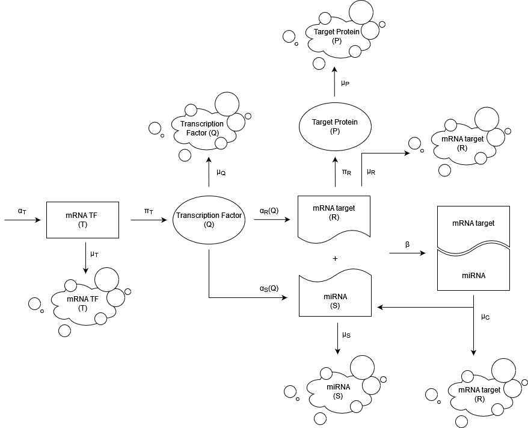
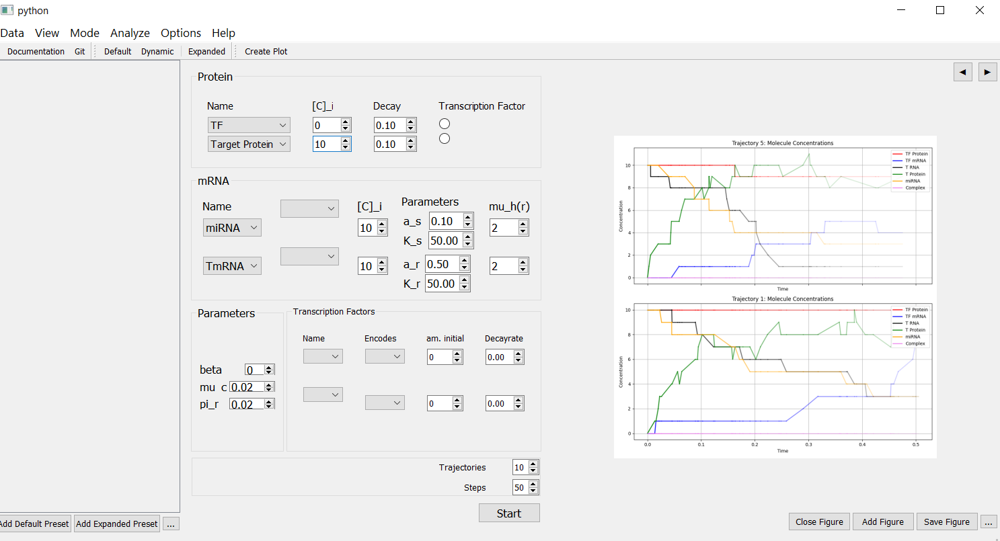

# `gillespie`: Python Gillespie Algorithm Simulation

This is an implementation of the Gillespie Algorithm in Python. The package by
default performs simulation of the miRNA-TF-target protein FFL.

The reactions included are:

- TF transcription (at a constant rate $\alpha_T$)
- TF translation into protein at rate $\pi_T$ per TF mRNA
- decay of the TF mRNA at rate $\mu_T$
- decay of the TF protein at rate $\mu_Q$
- miRNA production at rate $\alpha_S(q) = \alpha_S \frac{q}{q+K_S}$
- miRNA decay at rate $\mu_S$
- target mRNA transcription at rate $\alpha_R(Q) = \alpha_R \frac{q}{q+K_R}$
- target mRNA decay at rate $\mu_R$
- target protein production at rate $\pi_R$ per mRNA
- target protein decay at rate $\mu_R$
- free target mRNA binds the miRNA at rate $\beta$ to make a mRNA-miRNA complex
- mRNA-miRNA complex falls apart at rate $\mu_C$, with the mRNA being lost and
  the miRNA recycled.

By default, we simulate a system with 1 TF, 1 miRNA, and 1 target protein. To
simulate the system dynamically, we provide the GUI interface to set the
parameters and visualize the simulation.



## Key Features

1. **Improved GUI**
   - Simplified navigation and controls for setting up simulations.
   - Enhanced visualization tools to better represent data and results.
2. **Core Features**
   - Supports multiple simulation scenarios.
   - Dynamic updates to simulation parameters.

## Installation

Navigate to the root directory of this project, install the dependencies and
then install this package

```bash
cd /<project-root>
pip install -r requirements.txt
pip install .
```

For development purpose, one can install it as an editable package via `pip
install -e .`

### (Potential) Additional dependencies for GUI

On **Linux** systems, the following additional dependencies are required to run
the GUI (example for Ubuntu/Debian):

```bash
sudo apt install libxcb-xinerama0
sudo apt install '^libxcb.*-dev' libx11-xcb-dev libglu1-mesa-dev libxrender-dev libxi-dev libxkbcommon-dev libxkbcommon-x11-dev
```

## Usage

### Package usage

See `examples/example.ipynb` for a simple example of how to use the package.

### Command Line Interface (CLI)

After installing it as an editable package, one can simply run the simulation
via running the `gillepsie` command:

```bash
gillepsie --config <path-to-config-file> --plot True
```

### Graphical User Interface (GUI)

After installing the package, one can run the GUI via the following command:

```bash
gillepsie-gui
```

When the application window appears:

- Use the interface to specify the parameters for your simulation.
- Click the appropriate button to start the simulation.

As the simulation runs:

- View results in real-time via the interactive plot.
- Adjust parameters dynamically if supported.

 After the simulation:

- The defined parameters and the results are automatically saved for your
  convenience.
- Review the saved files for further analysis or reference.



### Enjoy exploring and simulating complex scenarios with **Glimpse Simulation**!

If you encounter any issues or have suggestions for improvement, feel free to
contribute or open an issue in this repository. Happy simulating!
